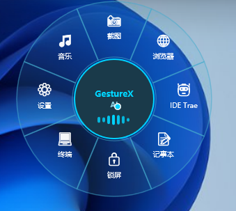

# GestureX

> 🚀 **Windows 系统级右键手势效率工具 轮盘快捷工具**
> 
> 本项目目前正处于 **TRAE AI 创造力大赛** 闭门研发与参赛阶段。我们已通过 Trae 独立进行工程构建，并锁定项目核心创意与开发时间戳。

---

## 🎬 核心功能演示

<table>
  <tr>
    <td align="center">
      <a href="https://www.bilibili.com/video/BV1bGj16SEKh/" target="_blank">
        <picture>
          
        </picture>
        

      </a>
    </td>
  </tr>
  <tr>
    <td align="center">
      <b>[TRAE AI 创造力大赛] 极致轻量轮盘快捷工具演示</b>
    </td>
  </tr>
</table>

👆 **点击上方封面图** 即可无缝跳转至 B 站播放器，观看最新内核特性与流畅度演示。
---

## 💡 项目愿景
Windows 用户的鼠标右键长久以来被“单点弹出菜单”所禁锢。`GestureX` 旨在打破这一常规，在不破坏任何原生右键点击习惯的前提下，开辟“右键拖动”的全新全局效率维度。通过像素级的防误触机制与流畅的轨迹识别，让你的右手掌握无限快捷可能。

## 🚀 最新版本特性：v0.1.1-alpha

本版本针对 Windows 底层最棘手的“全局改键冲突与系统级菜单拦截”深水区难题进行了核心技术破局，实现：
1. **零独占 Win 键**：键盘钩子完全不拦截物理 Win 键的 down/up 状态，完美透传。`Win+E`、`Win+D` 等系统原生组合快捷键 100% 照常生效。
2. **硬件级去抖（Key Repeat 抑制）**：完美识别并过滤长按 Win 键时硬件产生的高频自动重复 `WM_KEYDOWN` 脉冲，杜绝底层状态机被冲刷洗空的隐蔽死角。
3. **内核级“夹心释放”时序**：拒绝使用扫描码为 0 的幽灵键。 在手势完成抬键瞬间，通过注入紧凑的【Ctrl down → Win up → Ctrl up】时序， 利用真实扫描码（0x1D）的 Ctrl 遮罩键“夹住” Win up， 在内核层面完美抑制 Windows 开始菜单和鼠标右键菜单的弹出。

手势秒级响应，零余震，后台常驻精致优雅！

## 🔒 版权与商业声明 (License)
* **本项目为商业闭源项目**。
* 本公开仓库仅作为官方发布渠道、版本日志更新及问题反馈（Issues）使用。
* **版权所有 © 2026 Jacob / Gene. 保留所有权利。** 未经授权，严禁任何个人或团队抄袭、模仿本项目的核心交互逻辑用于同类竞争赛事或商业产品。

---
*更多 Demo 演示与下载链接将在大赛初赛阶段后正式在此开放，敬请期待！*